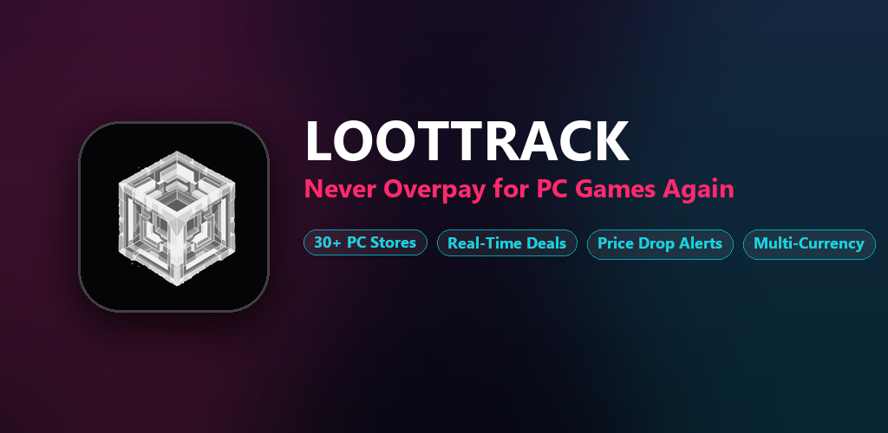
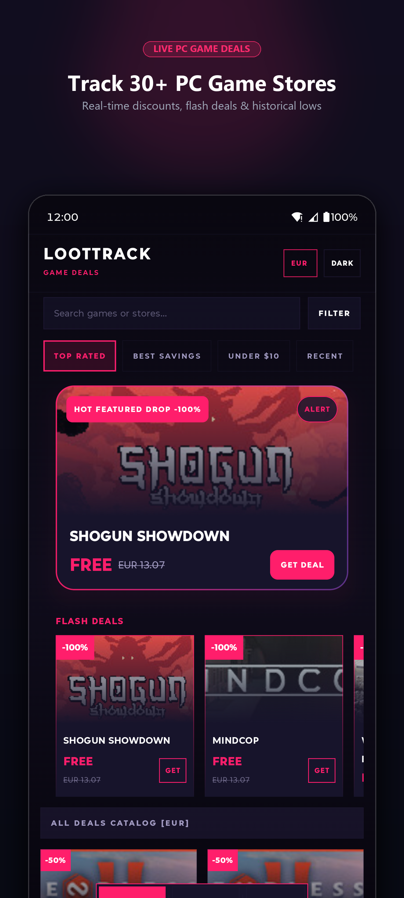
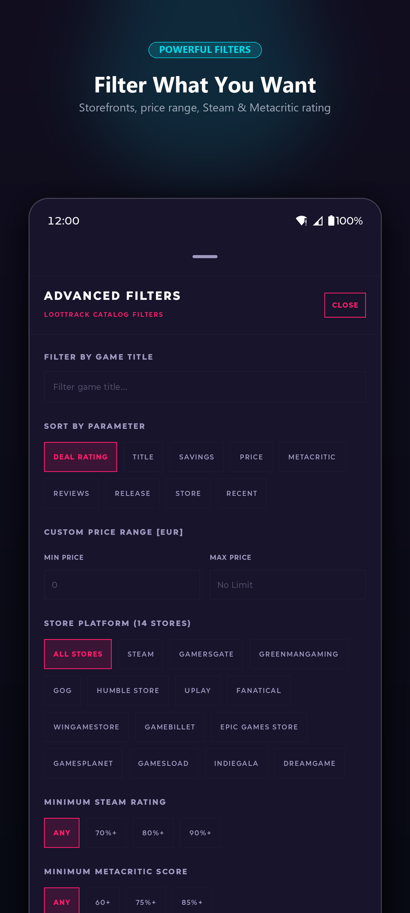
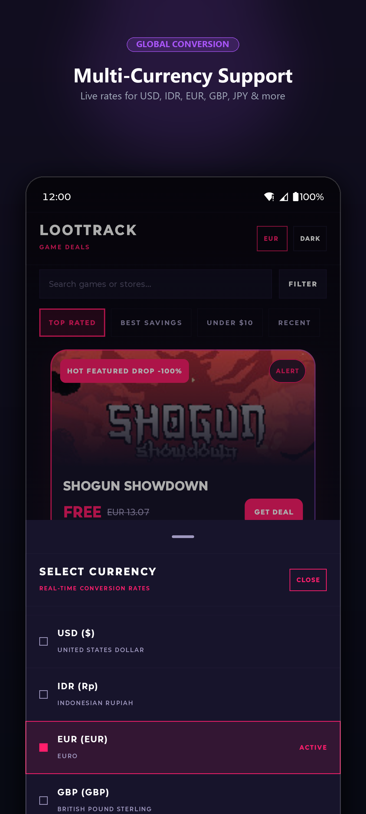
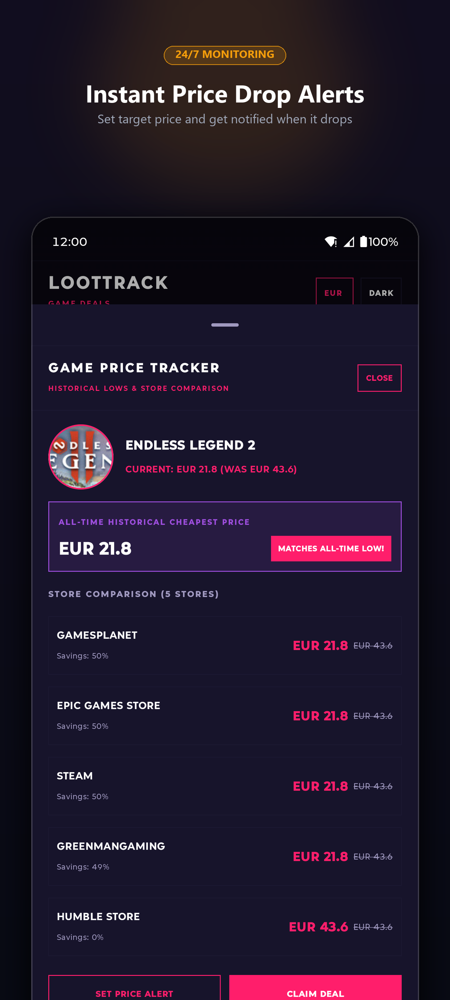

<p align="center">
  
</p>

<h1 align="center">LootTrack — Game Deals</h1>

<p align="center">
  <strong>Never overpay for a PC game again.</strong><br>
  Real-time PC game deal discovery across 30+ digital stores, multi-currency conversion, and automated price drop alerts.
</p>

<p align="center">
  <a href="https://play.google.com/store/apps/details?id=com.dirzaaulia.loottrack">
    
  </a>
  <a href="https://lt.dirzaaulia.com">
    
  </a>
</p>

<p align="center">
  
  
  
  
  
</p>

---

<p align="center">
  
</p>

## 📸 Play Store Marketing Showcase

| 🔍 Deal Discovery | 🏪 Store & Filter Options | 💰 Multi-Currency Engine | 🔔 Price Alerts & Watchlist |
|:---:|:---:|:---:|:---:|
|  |  |  |  |

---

## 🎮 Overview

**LootTrack** is a cross-platform application (Android and Web) built with **Kotlin Multiplatform** and **Compose Multiplatform**. It continuously aggregates thousands of PC game deals across 30+ digital storefronts in real time, compares pricing, tracks price drops, and converts deals into your local currency with live exchange rates.

Whether you're looking for flash discounts on Steam, Humble Store bundles, or GOG DRM-free promotions, LootTrack gives you the tools to track down the lowest prices and never miss a sale.

---

## 🔥 Key Features

- **🔍 Real-Time Deal Aggregation**: Browse thousands of PC game deals live across 30+ storefronts including Steam, Epic Games Store, GOG, Humble Store, Fanatical, Green Man Gaming, and more.
- **💰 Multi-Currency Support**: View deals in your preferred local currency with live daily conversion rates. Supports **USD, IDR, EUR, GBP, JPY, SGD, MYR, AUD, and CAD**.
- **🔔 Price Drop Alerts & Watchlist**: Set a target price for games you are eyeing. Our automated backend cron monitors prices 24/7 and delivers email notifications the moment the price hits your target.
- **🏪 Store Filtering**: Target specific digital storefronts so you only see deals from platforms and launchers you actually use.
- **🔃 Advanced Search & Sorting**:
  - Filter by Deal Rating, Retail Price, Savings Percentage, or Title
  - Minimum Metacritic score and Steam positive review rating thresholds
  - On-sale only filtering
  - Live title search
- **📊 Deep Deal Insights**: View comprehensive information including current sale price, original MSRP, savings percentage, Deal Rating, Metacritic score, Steam review percentage, and direct store deal links.
- **🌓 Adaptive Material 3 Design**: Built with Google Material 3 design system featuring modern dynamic theming, smooth layout animations, dark and light theme options, and adaptive side sheets for larger web viewports.

---

## 🛠 Tech Stack & Architecture

LootTrack uses modern Kotlin Multiplatform (KMP) and Jetpack Compose libraries:

### Frontend (Android & Web)
| Layer | Technologies |
|---|---|
| **Language & SDK** | Kotlin 2.4.20, Android SDK 37 (Min SDK 29) |
| **Framework** | Compose Multiplatform 1.12.0 (Material 3) |
| **Navigation** | Jetpack Navigation 3 (`org.jetbrains.androidx.navigation3`) |
| **Dependency Injection** | Koin 4.2.2 (`koin-core`, `koin-compose`, `koin-compose-viewmodel`) |
| **Networking** | Ktor 3.6.0 (OkHttp engine on Android, JS Fetch on Web) + Kotlinx Serialization |
| **Image Loading** | Coil 3.6.2 with Ktor 3 network fetcher |
| **Local Persistence** | Jetpack DataStore Preferences Core |
| **Monetization** | Google Mobile Ads (GMA) Next-Gen SDK 1.4.0 (Native ads & Adaptive Banners) |
| **Debugging** | Chucker HTTP Inspector 4.3.1 (debug builds) |

### Backend & Cloud Infrastructure
| Component | Technologies |
|---|---|
| **Price Alert Engine** | Cloudflare Workers (TypeScript) with Hourly Cron triggers |
| **Serverless Database** | Cloudflare D1 (SQLite) storing active watchlists and alert triggers |
| **Alert Delivery** | Resend API for transactional email notifications |
| **Web Hosting** | Firebase Hosting (Serving Kotlin/Wasm production executable) |
| **CI / CD & Deployment** | Fastlane automated Google Play Store metadata and release tracks |

---

## 📂 Project Structure

```
LootTrack/
├── androidApp/               # Native Android application entry point & AdMob setup
│   └── src/androidMain/
│       ├── AndroidManifest.xml
│       └── com/dirzaaulia/loottrack/MainActivity.kt
├── shared/                   # Shared Multiplatform module (Android & Web)
│   └── src/
│       ├── commonMain/       # Core business logic, Koin modules, Compose UI & ViewModels
│       │   └── com/dirzaaulia/loottrack/
│       │       ├── data/     # Repositories & DataStore
│       │       ├── di/       # Koin DI modules
│       │       ├── model/    # Domain data models & API responses
│       │       ├── network/  # Ktor HTTP client & API endpoints
│       │       ├── theme/    # Material 3 colors & typography
│       │       └── ui/       # Compose screens (Deals, Details, Filters, Alerts, Info)
│       ├── androidMain/      # Android-specific implementations (Chucker, DataStore context)
│       └── wasmJsMain/       # Web-specific implementations (window/browser integration)
├── webApp/                   # Compose Multiplatform Web (WasmJs & JS) host application
│   └── src/wasmJsMain/       # Web entry point & canvas initialization
├── cloudflare-worker/        # Serverless hourly cron worker for price alert checks
│   ├── src/index.ts          # Worker cron logic & Resend email integration
│   ├── schema.sql            # SQLite schema for user alerts
│   └── wrangler.toml         # Cloudflare Worker configuration
├── screenshots/
│   ├── store_listing/        # Play Store marketing banners & feature graphic
│   └── raw/                  # App screenshots & UI captures
└── fastlane/                 # Fastlane deployment automation and Google Play metadata
```

---

## 🚀 Getting Started

### Prerequisites
- **JDK 17+** (JDK 21 recommended)
- **Android Studio Ladybug | 2024.2+** or **IntelliJ IDEA**
- **Android SDK** with platform 37 installed
- **Node.js 18+** (for Cloudflare Worker and Web targets)

### Cloning the Repository
```bash
git clone https://github.com/dirzaaulia/LootTrack.git
cd LootTrack
```

---

## 💻 Running the Applications

### Android
Connect an Android device or launch an emulator, then run:
```bash
# Build and assemble debug APK
./gradlew :androidApp:assembleDebug

# Or install directly to connected device
./gradlew :androidApp:installDebug
```

### Web Application (Compose Multiplatform)
Run using Kotlin/Wasm (recommended for modern browsers) or Kotlin/JS:
```bash
# Wasm target (Development server with hot reload)
./gradlew :webApp:wasmJsBrowserDevelopmentRun

# JS target (Alternative browser support)
./gradlew :webApp:jsBrowserDevelopmentRun
```

To build production artifacts for web deployment:
```bash
./gradlew :webApp:wasmJsBrowserDistribution
# Output generated at: webApp/build/dist/wasmJs/productionExecutable
```

### Cloudflare Price Alert Worker
```bash
cd cloudflare-worker
npm install

# Local development / emulation
npm run dev

# Deploy to Cloudflare Workers
npm run deploy
```

---

## 🧪 Running Tests

Execute multiplatform tests using Gradle:
```bash
# Run Android host tests
./gradlew :shared:testAndroidHostTest

# Run Web tests
./gradlew :shared:wasmJsTest
./gradlew :shared:jsTest
```

---

## 📡 Data Sources & Attribution

LootTrack relies on public APIs to provide deal information and currency conversion:
- **[CheapShark API](https://apidocs.cheapshark.com/)**: Aggregates pricing, sales, and ratings across 30+ PC digital stores.
- **[FawazAhmed Currency API](https://github.com/fawazahmed0/exchange-api)**: Provides real-time daily foreign exchange rates.

---

## 🔒 Privacy & Permissions

- **Internet Access**: Required to query deal aggregators, exchange rates, and game details.
- **Notification Permission**: Used for price drop alerts and reminders.
- **No Mandatory Login**: Browse deals and track games without creating an account. Email addresses are only requested when saving price drop alerts.
- Read our full [Privacy Policy](https://lt.dirzaaulia.com/privacy).

---

## 👨‍💻 Author

Crafted with ❤️ by **Dirza Aulia**
- 🌐 Website: [dirzaaulia.com](https://dirzaaulia.com)
- 🐙 GitHub: [@dirzaaulia](https://github.com/dirzaaulia)
- ☕ Support: [ko-fi.com/dirzaaulia](https://ko-fi.com/dirzaaulia)

---

<p align="center">
  <sub>LootTrack is an independent project and is not affiliated with or endorsed by Valve, Steam, Epic Games, GOG, or CheapShark. All game titles, trademarks, and logos are property of their respective owners.</sub>
</p>